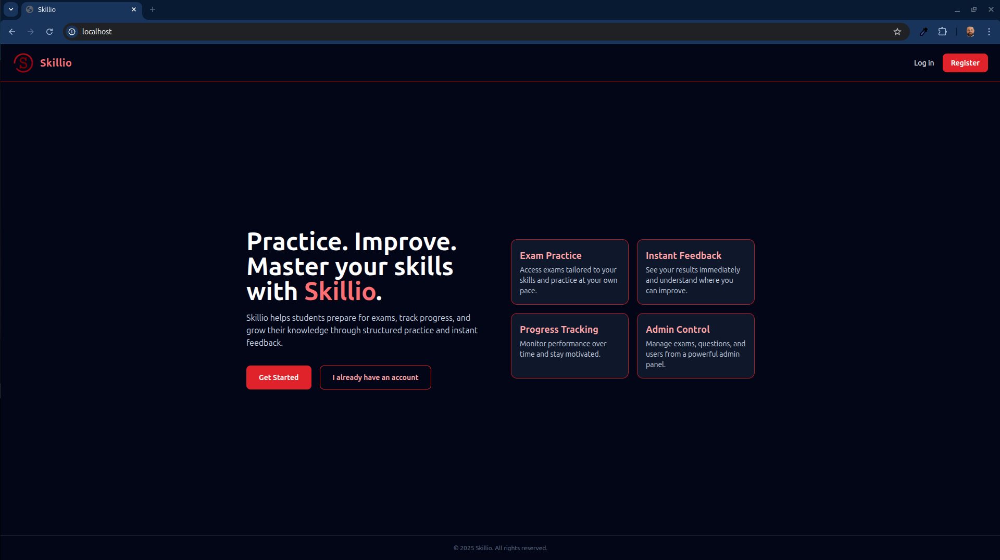

<p align="center">
  
</p>

# Skillio

**Skillio** is a Laravel-based platform designed to help users organize, track, and develop skills in a structured and practical way.  
It focuses on clarity, usability, and a clean UI to make skill management simple and motivating.

---

## Features

- Skill creation and categorization
- Progress tracking per skill
- Clean, modern, and responsive UI (Tailwind CSS)
- Authentication system (login & registration)
- User-specific dashboards
- Modular Laravel architecture
- Fast frontend development with Vite
- Docker-based local development (Laravel Sail)

---

## Tech Stack

- **Backend:** Laravel  
- **Frontend:** Blade, Tailwind CSS, Vite  
- **Database:** MySQL / PostgreSQL / SQLite  
- **Dev Environment:** Docker (Laravel Sail)  
- **Tools:** DBeaver, npm, Composer  

---

## Prerequisites

- Docker & Docker Compose  
- Git  
- Node.js (v18+)  
- npm  

---

## Installation

```bash
# Clone the repository
git clone https://github.com/damir-bubanovic/Skillio.git
cd Skillio

# Copy environment configuration
cp .env.example .env

# Start Docker containers
./vendor/bin/sail up -d

# Install PHP dependencies
./vendor/bin/sail composer install

# Generate application key
./vendor/bin/sail artisan key:generate

# Run migrations
./vendor/bin/sail artisan migrate

# Install frontend dependencies
./vendor/bin/sail npm install

# Start Vite dev server
./vendor/bin/sail npm run dev
```

Now open **http://localhost** in your browser.

---

## Folder Structure

```
app/
  Http/
  Models/
resources/
  views/
  css/
  js/
public/
  images/
database/
routes/
```

---

## Development Notes

- Frontend assets are handled via **Vite**
- Styling is done with **Tailwind CSS**
- Database can be inspected using **DBeaver**
- Docker containers are managed via **Laravel Sail**

---

## Production Build

```bash
./vendor/bin/sail artisan optimize
./vendor/bin/sail npm run build
```

Update `.env`:

```
APP_ENV=production
APP_DEBUG=false
APP_URL=https://your-domain.com
```

---

## Creator

**Damir Bubanović**

- [DamirBubanovic.com](https://damirbubanovic.com/)
- [GitHub](https://github.com/damir-bubanovic)
- [YouTube](https://www.youtube.com/@damirbubanovic6608)
- [Stack Overflow](https://stackoverflow.com/users/11778242/damir-bubanovic)
- [Yahoo Mail](mailto:damir.bubanovic@yahoo.com)

---

## Acknowledgments

- Built with **Laravel**, **Tailwind CSS**, and **Vite**
- Local development powered by **Docker & Laravel Sail**
- Developed and refined with the help of ChatGPT
